## 원본 EvalAI-Starters 보러가기

[EvalAI-Starters](https://github.com/Cloud-CV/EvalAI-Starters)를 보시려면 여기를 눌러주세요.

이 문서는 위의 문서에서 꼭 필요한 부분만 압축하여 만들어낸 단순화 버전입니다. 조금 더 많은 기능을 확인하시려면 위의 링크를 통해 확인하세요.

## Directory Structure

```
.
├── README.md
├── annotations                                 # Contains the annotations for Dataset splits
│   ├── test_annotations_devsplit.json          # Annotations of dev split
│   └── test_annotations_testsplit.json         # Annotations for test split
├── challenge_config.yaml                       # Configuration file to define challenge setup
├── evaluation_script                           # Contains the evaluation script
│   ├── __init__.py                             # Imports the modules that involve annotations loading etc
│   └── main.py                                 # Contains the main `evaluate()` method
├── logo.jpg                                    # Logo image of the challenge
├── submission.json                             # Sample submission file
├── run.sh                                      # Script to create the challenge configuration zip to be uploaded on EvalAI website
└── templates                                   # Contains challenge related HTML templates
    ├── challenge_phase_1_description.html      # Challenge Phase 1 description template
    ├── challenge_phase_2_description.html      # Challenge Phase 2 description template
    ├── description.html                        # Challenge description template
    ├── evaluation_details.html                 # Contains description about how submissions will be evalauted for each challenge phase
    ├── submission_guidelines.html              # Contains information about how to make submissions to the challenge
    └── terms_and_conditions.html               # Contains terms and conditions related to the challenge
```

## config 파일을 이용해서 챌린지를 생성하는 방법

1. 이 레포지토리를 다운받습니다.
2. 필요하다면, [EvalAI challenge creation documentation](https://evalai.readthedocs.io/en/latest/configuration.html) 을 읽고 구조를 파악합니다.
3. `challenge_config.yaml`을 먼저 열고, 적혀있는 주석을 바탕으로 챌린지를 세팅합니다.
4. `templates\`로 이동하여, 각 `html`에 맞는 문제 설명을 적습니다.
5. `annotations\`로 이동하여, 정답 파일을 넣습니다.
6. `evalutation_script\main.py`로 이동하여, `challenge_config.yaml`에 입력했던 정답 파일의 경로를 바탕으로 평가 코드를 작성합니다.
6. 모든 수정이 마무리 되었다면, `./run.sh` 명령어를 사용하여 `challenge_config.zip`을 만듭니다. (윈도우의 경우 이슈 참고)
7. [챌린지 업로드 링크](http://203.250.148.129:3088/web/challenge-host-teams)로 이동하여, 챌린지를 업로드합니다. (플랫폼 사용법은 아래에 자세히 나옵니다.)
8. 챌린지가 생성이 되면, 평가를 시작하기 위해 worker를 재시작해야 합니다. (worker 재시작 방법은 아래에 자세히 나옵니다.)
9. [챌린지 리스트](http://203.250.148.129:3088/web/challenges/list)에서 자신의 챌린지가 제대로 생성되었는지 확인하면 됩니다.

---

# 플랫폼 사용방법

## 회원가입


1. 아이디는 `학번`으로 설정하고 가입해주세요.

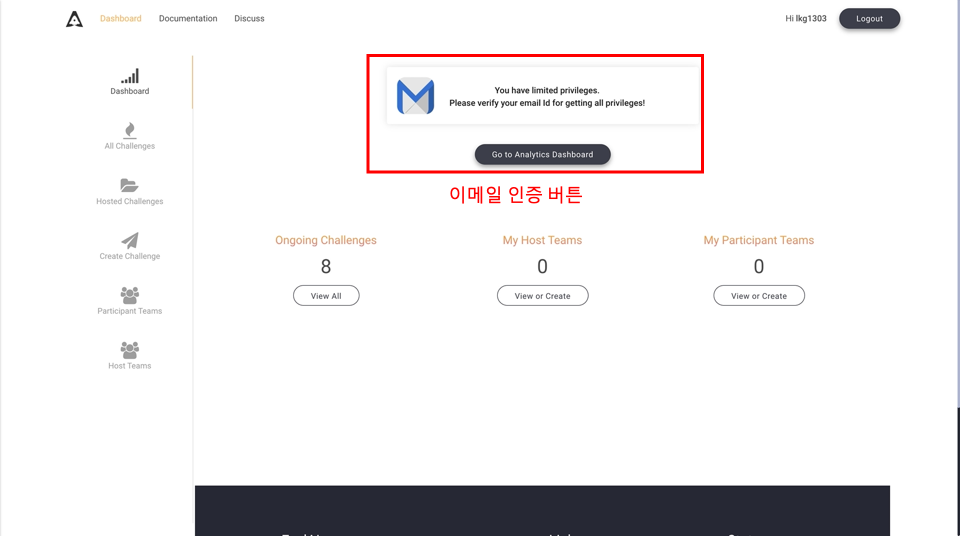

2. 가입후에는 이메일 인증이 필요합니다. 로그인을 하면 위와 같은 페이지가 뜹니다.

- 회원가입시 입력한 이메일로 10분이상 기다려도 메일이 오지 않는다면, 이메일 인증 버튼을 누르고 3번으로 진행하세요.

- 메일이 도착했다면 4번으로 진행하세요.

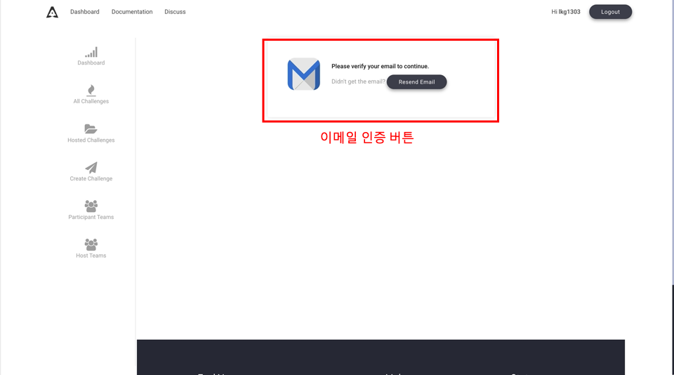

3. 인증 메일을 다시 받기 위해 표시된 부분의 버튼을 누릅니다.

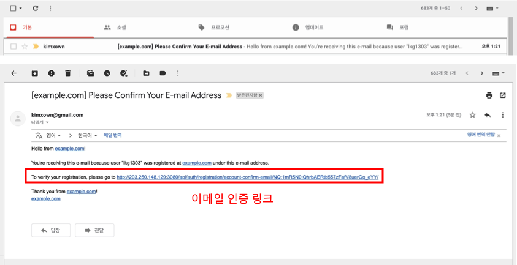

4. 인증 메일은 ```최대 10분```까지 늦게 전송될 수 있습니다. 위의 이미지의 ```이메일 인증 링크```를 클릭하면 이메일 인증이 완료됩니다.

## 챌린지 만들기

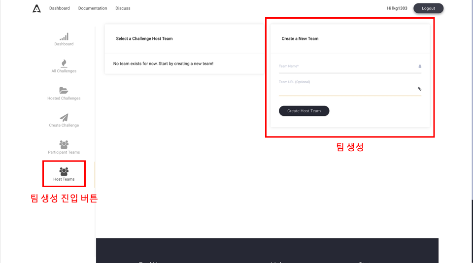

1. 챌린지를 생성하기 위해서는 팀을 만들어야합니다. 위의 이미지와 같이 왼쪽 `팀 생성 진입 버튼`을 눌러, 팀 생성 페이지에 들어갑니다. 그리고 오른쪽의 `팀 생성`칸에서 팀을 만들 수 있습니다. 

---

### 주의사항
```
팀 이름은 알파벳 및 숫자만 허용됩니다.
```

---

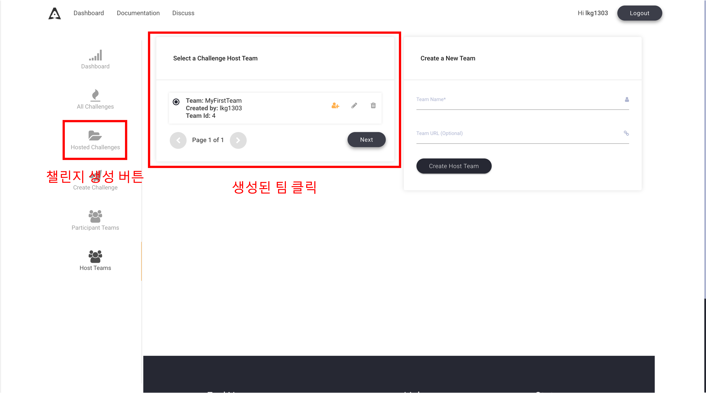

2. 팀을 생성하면 이제 `챌린지 생성 버튼`을 눌러 챌린지를 만들러 이동합니다. 생성한 팀을 누르면, `Next`버튼이 활성화되는데 눌러 다음으로 진행합니다.

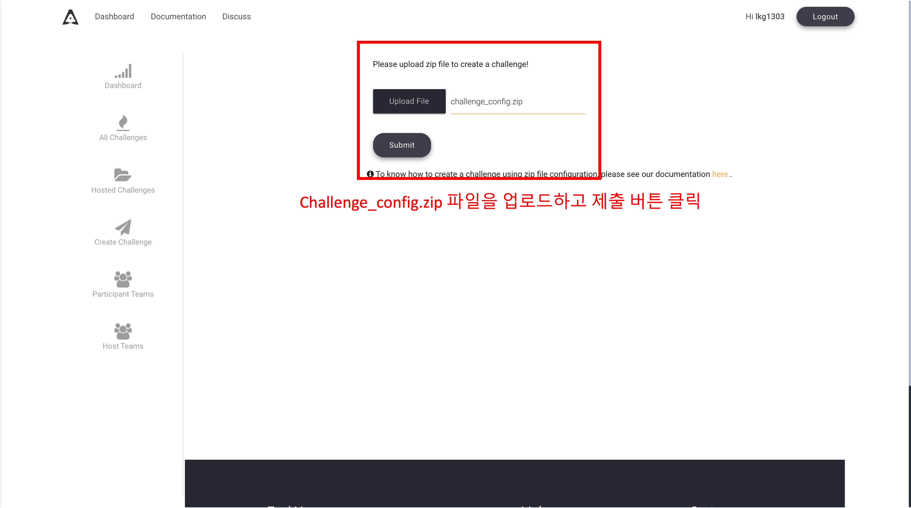

3. `config 파일을 이용헤서 챌린지를 생성하는 방법`을 통해 생성한 challenge_config.zip을 업로드하고 제출 버튼을 클릭합니다.

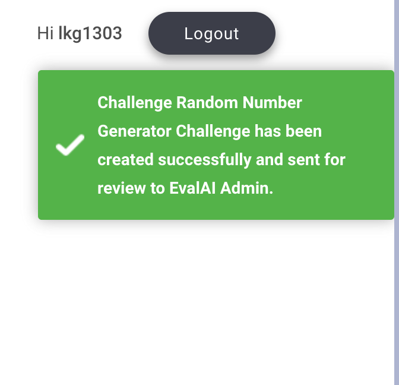

4. 업로드에 성공하면, 페이지가 리다이렉팅되며 오른쪽 위에 이와 같은 성공 메세지가 출력됩니다.


5. 챌린지는 `챌린지 확인 버튼`을 통해 확인할 수 있습니다.

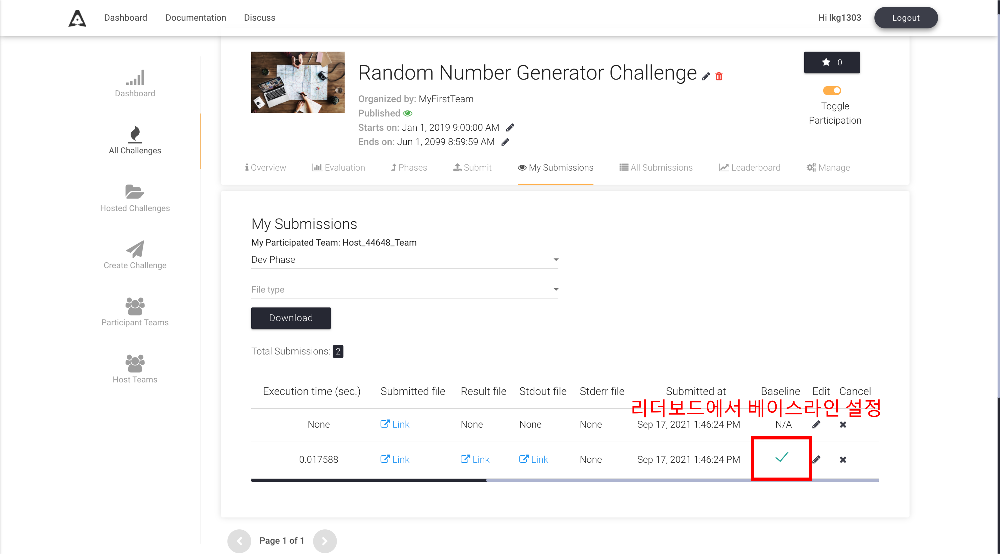

6. 챌린지를 생성했으면, baseline을 등록해야합니다. baseline 파일을 제출하고, 위 그림에 위치한것처럼 baseline에 버튼을 눌러 baseline을 설정합니다.

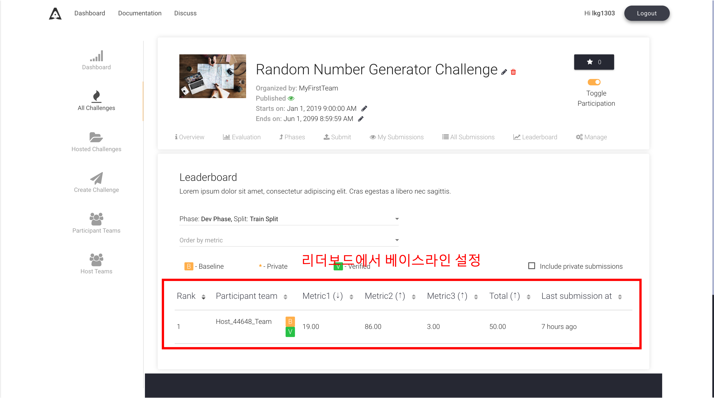

7. 그러면 리더보드에서 베이스라인이 설정된 것을 볼 수 있습니다. 참고로 verified는 all submission에서 설정할 수 있습니다.

## 챌린지에 정답 제출하기

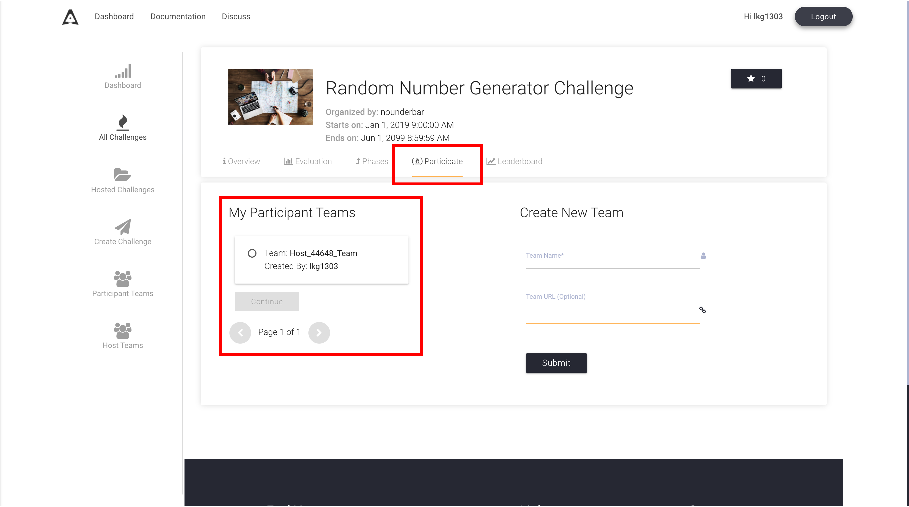

1. 정답을 제출하려면 먼저 챌린지에 참가해야합니다. 위의 이미지처럼 챌린지에서 참가를 누르고 어떤 팀으로 참여할지 선택하여 참여합니다.

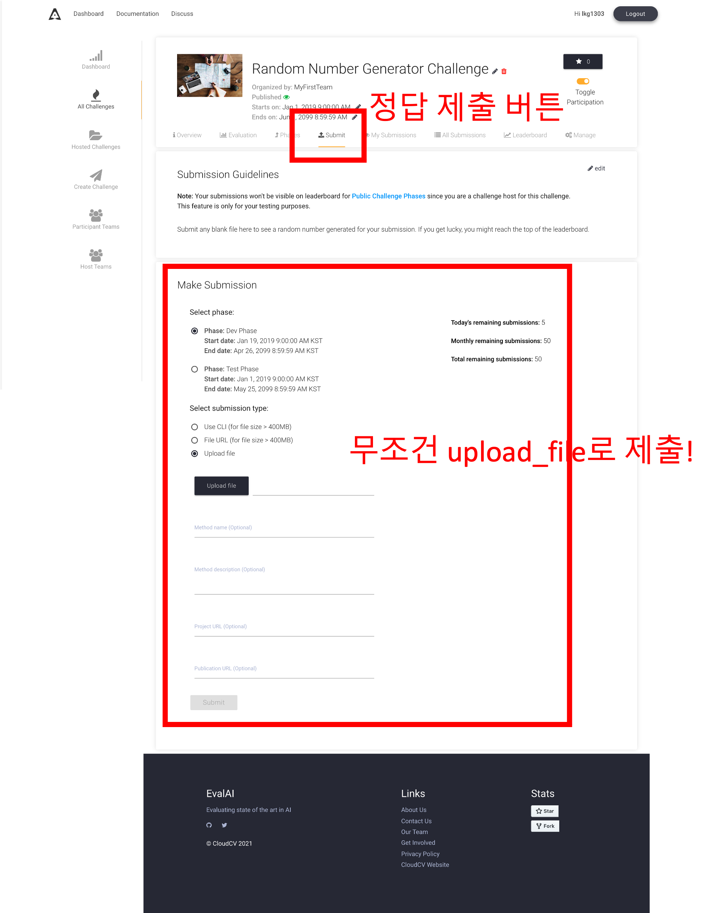

2. 정답을 제출하기 위해서는 챌린지로 접속하여 `정답 제출 버튼`을 누르고 제출할 수 있습니다.

3. 각 챌린지에 맞는 `phase`를 고르고, 제출하면 됩니다.

4. 정답 제출은 위 이미지와 같이 `upload_file`로만 제출해주세요.

5. 이렇게 제출한 파일은 챌린지의 `Submission`버튼들에서 확인할 수 있습니다.

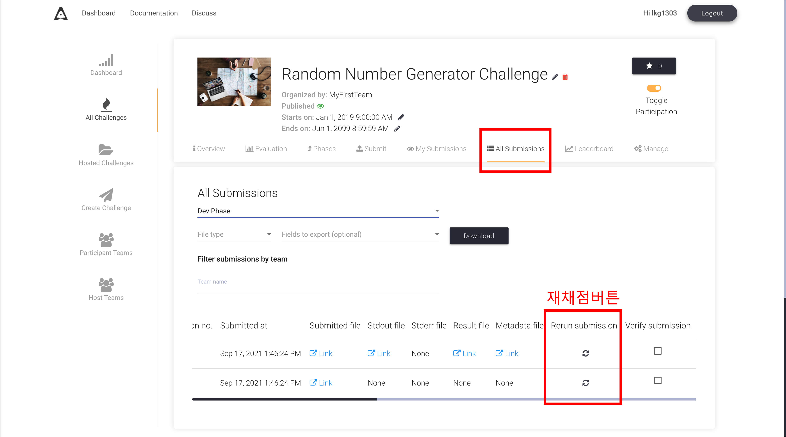

6. 만약 채점이 되지 않았다면, worker 재시작의 문제거나 작성한 evaluation script의 문제입니다. 재체점은 위 이미지처럼 재채점 버튼을 누르면 가능합니다.

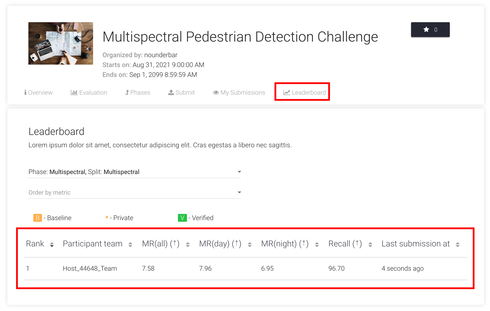

7. 정상적으로 챌린지가 만들어졌다면, 위와 같이 리더보드에서 제출한 정답지의 성능을 확인할 수 있습니다.

## 챌린지 수정 하기

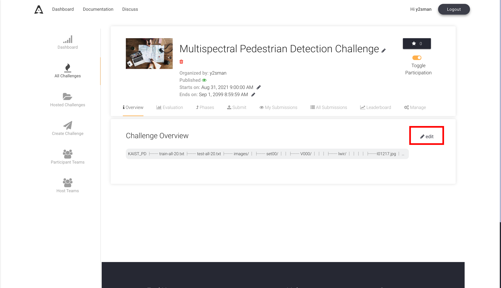

1. 챌린지 내용을 수정하고 싶으면 각 페이지에서 edit 버튼을 누르면 수정할 수 있습니다.

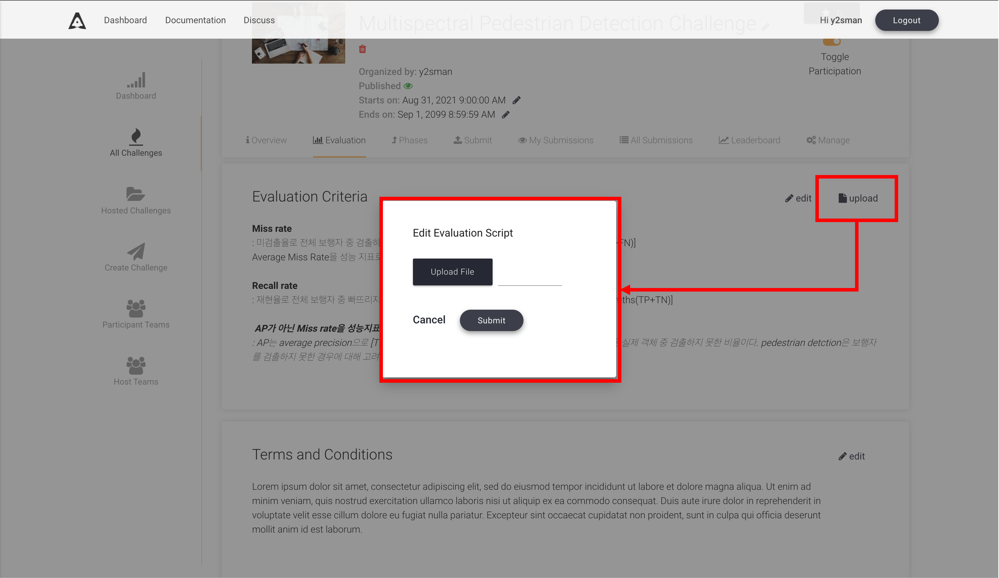

2. evaluation code의 수정이 필요한 경우 위의 그림처럼 새로 업로드해 수정할 수 있습닏.

---

# Worker 재시작 방법

1. 참여하고 있는 슬랙의 지정된 채널에서 `reboot`라고 입력합니다.

2. 얼마간의 시간이 지나고 재시작이 완료되면, `Works done!@username!`이라고 봇이 응답합니다.

3. 1~3분여 정도 후에 테스트 파일을 제출해서 평가가 제대로 수행되는지 확인하면 됩니다.

## 주의사항

1. worker 재시작에 시간이 많이 소요될 수 있습니다. 타인이 재시작 중이라면 기다립시다.

2. 누군가가 재시작중이라면, 챌린지 생성에 문제가 발생할 수 있습니다. 채널을 보고 재시작중이라면 잠시 기다렸다가 챌린지를 생성해주세요.

3. 재시작은 챌린지 생성 이후 최초 1회만 필요합니다.

4. 서버에 이상이 있는 경우에는 `status`를 입력하면, 도커 상태를 반환하도록 처리해두었습니다. 이를 통해 평가 서버의 상태를 확인하실 수 있습니다.
